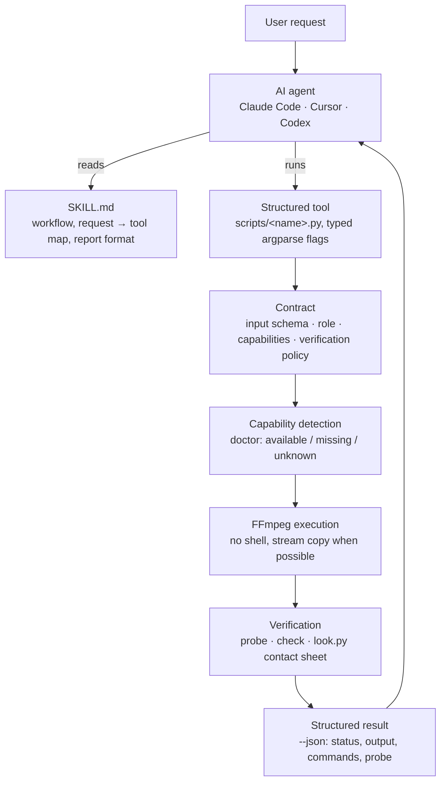
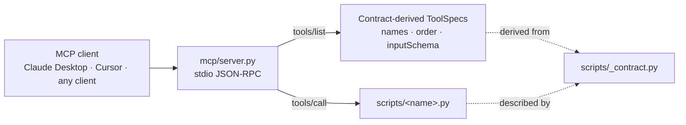

<p align="center">
  
</p>

<h1 align="center">ffmpeg-skill</h1>

<p align="center"><strong>Give your coding agent a video editor.</strong></p>

<p align="center">
  Local FFmpeg · No cloud · No API keys · Python standard library<br>
  Claude Code · Cursor · Codex · MCP
</p>

<p align="center">
  <a href="https://github.com/kajisho5/ffmpeg-skill/actions/workflows/ci.yml"></a>
  <a href="https://github.com/kajisho5/ffmpeg-skill/actions/workflows/codeql.yml"></a>
  <a href="https://www.npmjs.com/package/ffmpeg-skill"></a>
  <a href="https://www.npmjs.com/package/ffmpeg-skill"></a>
  <a href="https://github.com/kajisho5/ffmpeg-skill/stargazers"></a>
  <a href="https://github.com/kajisho5/ffmpeg-skill/commits/main"></a>
  
  <a href="#ffmpeg-compatibility"></a>
  <a href="LICENSE"></a>
  <a href="https://github.com/sponsors/kajisho5"></a>
</p>

```bash
npx ffmpeg-skill
```

<table>
  <tr>
    <td width="50%"><br><sub><code>caption.py --animate pop --karaoke</code></sub></td>
    <td width="50%"><br><sub><code>fit.py --aspect 9:16 --fit crop</code></sub></td>
  </tr>
  <tr>
    <td width="50%"><br><sub><code>silence.py --threshold -35</code></sub></td>
    <td width="50%"><br><sub><code>loudness.py -I -14 --tp -1</code></sub></td>
  </tr>
</table>

Left half is the input, right half is what the command produced. **[All 53 before/after demos, with the exact command under each one →](docs/demos.md)** — all of it generated from synthetic footage by `python3 demos/build.py`, so you can rebuild every frame of it yourself.

`ffmpeg-skill` is an [Agent Skill](https://docs.anthropic.com/en/docs/agents-and-tools/agent-skills) for Claude Code, Cursor, Codex and any agent that reads `SKILL.md`. It teaches the agent a fixed workflow (probe → edit losslessly where possible → check → verify) and ships **42 tools** that do the actual work with `ffmpeg` / `ffprobe`: cut, join, silence removal, fit to duration and aspect, captions and karaoke, overlays and motion graphics, HDR → SDR and LUTs, audio clean-up and typed dynamics, sync with drift correction, multicam, loudness, delivery checks, whole-edit project rendering, batch folders. Every tool is also callable as an MCP tool (`tools/list` advertises a core 12 by default to keep client context small, with `FFMPEG_SKILL_MCP_FULL=1` listing all 42; every tool is reachable by name through `tools/call` either way), and the whole set is described by a machine-readable contract.

If `ffmpeg` and `python3` are on your PATH, it works: offline, on footage you would rather not upload.

> **SPEC** (Self-Producing Execution Contract): each tool's `input_schema` — the part of its
> contract and MCP tool definition that has to track the CLI flag-for-flag — is never
> hand-authored beside the code. It is derived, at run time, from the same `argparse` parser that
> already defines the CLI, and CI fails the build if any of it drifts.
> → [full explanation](#what-is-spec)

---

## Standalone, and in an ecosystem

**Standalone**, this is a local FFmpeg engine: probe → edit → verify, `npx ffmpeg-skill` and nothing else. No API key, no account, no other repo required. Everything above and below this section describes that standalone tool, and none of it changes if you never read the rest of this one.

**In [kajisho5](https://github.com/kajisho5)'s wider video-production ecosystem**, this repo is the *hands*: it cuts, measures and exports files, and reports back in structured JSON. It does not decide what to cut, whether a deliverable is approvable, what makes a highlight interesting, or what a caption should say (the user's cue text is burned as written, never rewritten to fit) — those are a *brain*'s job, sitting in front of this engine, not inside it.

| You want to... | Use |
|---|---|
| Cut / join / measure / export a file right now | **this repo** (`ffmpeg-skill`), standalone |
| Decide cut points, approve a deliverable, plan a whole edit | [`video-production-agent`](https://github.com/kajisho5/video-production-agent) / [`AI-video-production-OS`](https://github.com/kajisho5/AI-video-production-OS) |
| Build a typed editing graph across a workspace, without writing raw `ffmpeg` | [`video-editing-skill`](https://github.com/kajisho5/video-editing-skill) / [`audio-production-skill`](https://github.com/kajisho5/audio-production-skill) |

Other repos in the ecosystem — [`media-analysis-skill`](https://github.com/kajisho5/media-analysis-skill), [`transcription-skill`](https://github.com/kajisho5/transcription-skill), [`subtitle-skill`](https://github.com/kajisho5/subtitle-skill), [`thumbnail-skill`](https://github.com/kajisho5/thumbnail-skill), [`color-grading-skill`](https://github.com/kajisho5/color-grading-skill), [`motion-graphics-skill`](https://github.com/kajisho5/motion-graphics-skill), [`qc-skill`](https://github.com/kajisho5/qc-skill) — read this repo's `contract --json`, its tools' `--json` output and `doctor`, the same way any agent framework would; this repo does not call into any of them. The dependency runs one way.

---

**Contents**
[Standalone, and in an ecosystem](#standalone-and-in-an-ecosystem) · [Why](#why) · [Quick start](#quick-start) · [How it works](#how-it-works) · [Design principles](#design-principles) · [Tools](#tools) · [Audio](#audio-is-a-first-class-input) · [Built for agents](#built-for-agents) · [FFmpeg compatibility](#ffmpeg-compatibility) · [Tested on real footage](#tested-on-real-footage) · [Install](#install) · [Requirements](#requirements) · [Development](#development) · [Docs](#docs)

---

## Why

An agent that "knows FFmpeg" still guesses: it assumes a frame rate, picks a codec the container cannot hold, re-encodes a file that only needed a stream copy, and reports "done" without opening the result. This skill takes the guessing out:

- **Real files first.** Every job starts with `probe.py`; the agent decides from the measured duration, fps, resolution, colour and audio layout, not from the file name.
- **Structured tools, not shell strings.** Each operation is a script with typed arguments. Nothing runs through a shell; no filter graph is accepted from the caller.
- **A contract the agent can read.** `contract --json` states, for every tool, what it takes, what it writes, which FFmpeg components it needs and how the result is verified. The MCP surface is derived from it.
- **Verification after execution.** The result is probed, checked against the destination's spec and, when the picture changed, looked at as a contact sheet.
- **Local first.** No cloud, no API keys, no Python dependencies. Optional local transcription is used when a whisper is installed, never required — by `caption.py --transcribe` and, since 1.17, by `silence.py --filler --transcribe`; both take a transcript you already have instead, and both refuse with the install lines rather than guessing.

## Quick start

```bash
# 1. install the skill for Claude Code (Cursor: --cursor, Codex: --codex, all three: --all)
npx ffmpeg-skill

# 2. check the machine: ffmpeg, ffprobe and every FFmpeg component the tools need
npx ffmpeg-skill doctor

# 3. (for agent frameworks) read the machine-readable contract
npx ffmpeg-skill contract --json | head -40
```

Already installed? re-run `npx ffmpeg-skill` to refresh `~/.claude/skills/ffmpeg-skill`. Copies are not updated automatically.

`doctor`'s overall `ok` and a single tool's `usable: no` are different signals: `ok` means nothing *required by every tool* is missing, but a plain Homebrew `ffmpeg` on macOS can still be `ok` while `caption.py` specifically can't run (no `subtitles` filter) — check `doctor --json`'s `tools` field for the per-tool answer, not just `ok`.

Then talk to your agent:

> "Take `interview.mp4`, keep 0:45–3:10 and 5:00–6:30, and make it exactly 60 seconds for Reels."

The agent runs `probe.py`, `cut.py --segments 0:45-3:10,5:00-6:30`, `fit.py --duration 60 --aspect 9:16 --fit crop`, `export.py --preset reels`, `check.py --platform reels` and `look.py`, then reports "final.mp4: 59.98 s, 1080×1920, 30 fps, AAC stereo" with the contact sheet it inspected.

### Deliver to a platform

One command per destination, with the app's own UI taken into account:

```bash
python3 $S/render.py talk.mp4 --template tiktok --cues cues.txt
```

That fills the shipped `templates/tiktok.json`: 9:16 crop, captions popped word by word *above*
TikTok's description bar and clear of its like column, −14 LUFS, the `tiktok` export preset, and
a `check.py --platform tiktok` on the file it wrote. The caption size comes from the delivery
table, so since 1.17.1 the filled project also states `"fit_size": "on"`: a size nobody asked for
shrinks to fit the cue instead of splitting the sentence across two cues. A template that states
its own `fit_size`, and a `--brand` that states a caption size, still win, and a project with
`"fit_size": "off"` renders the captions 1.17.0 rendered. Templates ship for `tiktok`, `reels`,
`shorts`, `youtube-shorts`, `youtube`, `x`, `linkedin`, `facebook` and `podcast`;
`--template all` (or a comma-separated list) renders every destination from the same edit and
writes a `<name>_pack.md` table of what each one produced. Files land next to the input unless
`-o` says otherwise, and `--dry-run` shows every planned command rather than a result.
`render.py --list-templates` prints them with their frames, limits and safe zones. Alias
spellings work everywhere a platform is named (`youtube-shorts` = `shorts`, `ig` = `reels`,
`twitter` = `x`, `fb` = `facebook`).

The tools also work on their own, from any shell:

```bash
S=~/.claude/skills/ffmpeg-skill/scripts
python3 $S/probe.py input.mp4 --compact
python3 $S/fit.py input.mp4 --duration 60 --aspect 9:16 --dry-run    # print the plan, run nothing
python3 $S/export.py input.mp4 --preset reels --json                 # structured result with a probe of the output
```

On Windows in Git Bash, `python3` is only on PATH if Python was installed from the Microsoft Store; a python.org install exposes `python` (or the `py` launcher) instead — replace `python3` with `python` above if you see a "command not found". `bin/install.js` and `doctor`/`contract` already handle this for you; only the raw script examples above need it spelled out manually.

More requests and the commands behind them: [examples/README.md](examples/README.md). To see everything run end-to-end on generated footage: `npm run demo` (the gallery in [docs/demos.md](docs/demos.md)).

## How it works



Over MCP the same tools are reached through a transport that holds no tool table of its own:



Names, order and `inputSchema` in `tools/list` are translated from each tool's argparse parser at start-up, so a new flag or a new script appears in MCP with no edit to `mcp/`. A test copies the skill, adds, removes and edits a script, and reads `tools/list` again to prove it.

## Design principles

These are the rules the skill file gives the agent and the code enforces.

1. **Probe first.** No tool decides from the file name. `probe.py` measures duration, fps (with variable-frame-rate detection), resolution, rotation, bit depth, HDR format including Dolby Vision, colour tags and every audio stream before anything is cut.
2. **Lossless when possible.** `cut.py`, `join.py` and `loudness.py` stream-copy what they do not need to touch. Re-encoding happens only when it must: frame-accurate cuts, filters, format changes, or a keyframe farther than the tolerance.
3. **Plan before render.** Every tool takes `--dry-run` (print the ffmpeg command lines, write nothing), `--plan FILE` (the dry run saved as a plan with fingerprinted inputs that `render.py FILE` executes later, refusing if an input changed), `--json` (structured result with a probe of the output), `--fast` (preview quality), `--progress` (percent and ETA), `--timeout` (a hung ffmpeg is killed and reported, never waited on forever; Ctrl-C or SIGTERM likewise stops the running ffmpeg, removes its partial output and reports `kind: interrupted`) and `--overwrite` (explicit consent before an existing output is replaced). A test runs every tool under `--dry-run` behind a fake ffmpeg and asserts that no ffmpeg call happened and no file appeared.
4. **Machine-readable contract.** `contract --json` describes all 42 tools: input schema generated from the parser, output schema, role, required and conditional FFmpeg capabilities, dry-run support, the verification tools to run afterwards, whether a visual check is required, `mutates_input: false`. `provides` lists all 42 by a cross-repository Capability id (`ffmpeg-skill.cut`, `ffmpeg-skill.loudness`, ...) for [`kajisho5/AI-video-production-OS`](https://github.com/kajisho5/AI-video-production-OS)'s `CapabilityContract.provides` — see `docs/contract.md`.
5. **Contract-derived MCP.** `mcp/server.py` builds its `tools/list` from the contract. Tool names, order and `inputSchema` cannot drift from the scripts; a test keeps the two byte-identical.
6. **Capability detection.** `doctor` reads `ffmpeg -encoders / -filters / -bsfs` and reports which of the components the tools need are present on this build (libx264, libass, zscale, loudnorm, xfade, …), before a job fails inside ffmpeg.
7. **Unknown is not missing.** When a listing cannot be read (a layout the parser does not know, ffmpeg exiting non-zero) the affected capabilities are `unknown`: never `missing`, never silently `available`. An installed filter is not reported absent; a failed detection is not a pass.
8. **Verify the result.** The output is probed, and when the picture changed (captions, overlays, crops, colour, transitions) the agent runs `look.py` and inspects the PNG. The report is not finished until its `Look:` line names that image; audio-only jobs say `Look: not needed`. **"Inspects" means the calling agent's own vision, not a feature of this skill:** `look.py` only renders a PNG; nothing in this repository detects faces, products, subjects, or "the interesting part" of a frame or a scene. When a crop or reframe needs to keep a specific part of the frame (`fit.py --fit crop --crop-x/-y`, see [Tools](#tools)), it is the multimodal agent looking at that PNG and choosing the anchor — a non-visual caller (a script, a CLI user without eyes on the sheet) has to supply that decision itself, and the default is a plain centre crop. Likewise `scenes.py --highlights` ranks candidate scenes by a measured proxy (`--rank-by audio` or `--rank-by duration`), never by content; it is the agent that turns a look at the sheet into a judgement.
9. **One label per report.** A finished job is `Done:`, a failure or a refusal is `Failed:`, and a partial result is `Done:` with the shortfall named in `Notes:` — never a third label such as `Done (partially):`.
10. **Keep originals.** No tool overwrites its input. Outputs are new files named `<input>_<operation>.<ext>` unless told otherwise, and a test hashes every input after the run.

## Tools

42 public tools, all Python 3.9 standard library, all with `--help`, `--dry-run`, `--json`, `--plan FILE` (a dry run written as a plan `render.py` executes later), non-zero exit and a reason on stderr on failure. `--json-brief` (1.11.0) prints the same result document trimmed to what a caller acts on — status, output, `verified`, a compact `summary` of the output probe, the tool's own keys and the command count instead of the command lines — for roughly a third of the bytes; `--json` itself is unchanged. Every re-encoding tool takes `--codec h264|hevc|av1|prores` and `--quality N` (1.8), and every time flag takes seconds, `mm:ss`, `hh:mm:ss.fff` or SMPTE `hh:mm:ss:ff` with an optional `@fps` suffix (1.9).

**Analysis and inspection**

| Tool | What it does |
|---|---|
| `probe.py` | Duration, fps (+ VFR detection), resolution, codecs, bit depth, HDR format incl. Dolby Vision (`hdr` for a real PQ/HLG/DV transfer only, `bt2020_or_hdr` also for BT.2020 SDR), colour space, rotation, every audio stream; `--analyze` flags Log footage |
| `scenes.py` | Scene changes, audio peaks, highlight proposals (`--rank-by audio` loudest, or `--rank-by duration` longest — both proxies, not "best") and a per-scene sheet; cut list for `cut.py --segments`; `--beats` measures the music's beat grid (tempo, beat times, confidence); `--shots` classifies each shot static/pan/motion by measured optical flow; `--audio-peaks` lists per-second dBFS; `--speech` reports a speech-vs-music ratio, not a classification |
| `look.py` | Contact sheet, single frames, side-by-side comparison as PNG so the agent can see what it made; `--safe NAME` shades the zones a platform's own UI covers |

**Editing**

| Tool | What it does |
|---|---|
| `cut.py` | In/out or multi-segment cuts, lossless `-c copy` first, re-encode fallback, `--accurate` for frame-exact video and sample-exact audio; reports `precision`; `--snap beats` moves the in/out points onto a measured beat, or refuses when there is no measurable pulse |
| `join.py` | Concatenate clips with xfade transitions, normalising size, fps, sample rate and channel layout (the widest clip's, or `--channels`); audio-only inputs are joined as audio; `--list parts.txt` reads generated segments (TTS lines) and checks every one first — missing, empty or unreadable parts are all named in one refusal, or skipped and reported with `--on-missing skip` |
| `silence.py` | Detect and remove dead air (jump cuts) with a margin around speech; list or export the cut list; `--filler` also removes filler words, but only where a speech engine timed them; `--speech-aware` keeps a breath inside a sentence and cuts only at sentence-boundary pauses, composing with `--filler` through the same `keep_ranges()` |
| `fit.py` | Fit to a duration (pitch-preserving speed change or trim, smooth slow-mo) and/or aspect ratio (pad, crop or `--fit blur`'s blurred, darkened fill, with `--crop-x`/`--crop-y` to keep an off-centre subject) and/or exact `--width`/`--height`; rotate 90/180/270, flip h/v; force constant fps |
| `crop.py` | Crop to an exact pixel rectangle (`--x --y --width --height`) — distinct from `fit.py --fit crop`, which crops to an aspect ratio it computes itself |
| `cropdetect.py` | Measure existing black letterbox/pillarbox bars and report the `crop.py`-ready rectangle that removes them — analysis only, writes no file; `--motion-centre` reports the per-second motion centroid instead, for a 9:16 reframe — report only, the calling agent picks the crop, no auto-reframing |
| `deinterlace.py` | Deinterlace interlaced source footage (`yadif`), `--mode frame`/`field`, `--parity` |
| `denoise.py` | Reduce video noise/grain (`hqdn3d`), `--strength low/medium/high` or individual spatial/temporal overrides |
| `redact.py` | Blur or pixelate an exact pixel rectangle for the whole clip (privacy/compliance redaction) |
| `sphere.py` | Extract a flat rectilinear viewport from a 360/spherical video (`--yaw --pitch --roll --h-fov --v-fov`); no subject tracking, only the aim you give it |
| `straighten.py` | Rotate by an arbitrary angle for horizon correction (`--degrees`, `--fit crop/pad`) — distinct from `fit.py --rotate`'s exact 90-degree turns |
| `insert.py` | Turn a still image into a silent, fixed-duration video clip (title card, end slate) at an exact frame size / fps, with an optional Ken Burns zoom/pan |
| `background.py` | Generate a solid-colour or two-colour gradient clip at an exact size/duration — no input file |
| `reverse.py` | Reverse playback (video and, unless `--no-audio`, audio) |
| `stabilize.py` | Two-pass motion stabilisation (`vidstabdetect`/`vidstabtransform`) |
| `sequence.py` | Numbered (`frame_%04d.png`) or glob-matched still images into a video |
| `waveform.py` | Render an audio track as a waveform or spectrum visualization video (`showwaves`/`showspectrum`) — for audio-only inputs with no picture worth showing; `--image` puts the visualisation over a still plate (an audiogram), with `--platform`, `--title` and burnt-in captions |
| `freeze.py` | Hold a frame for N seconds (`--at`, `--hold`, `--mode insert/extend`) — an end-card hold or a comedic beat |
| `pad.py` | Add black/silent padding at the start and/or end of the timeline (`--start`, `--end`) — distinct from `fit.py --fit pad`'s per-frame letterbox bars |
| `speedramp.py` | Step through different constant speeds across a clip via `--segment START-END:FACTOR` (repeatable) — distinct from `fit.py`'s single whole-clip speed factor |
| `loop.py` | Repeat a clip `--times` N or to a target `--duration` — for background loops and filling a fixed slot length |
| `broll.py` | Cut away to a B-roll clip over the A-roll for a window (`--insert B --at T --duration D`, repeatable) and come back; A's length and audio untouched by default |
| `metadata.py` | Write container chapter markers from a `TIME TITLE` text file and title/artist/comment tags, every stream copied bit for bit; `--auto-chapters` proposes the markers from measured pauses and scene cuts and names them `Chapter N` for you to rename |
| `grid.py` | Composite `--cols`x`--rows` clips into one grid, each cell letterboxed and labelled with its filename by default (`--label none` to skip) |

**Audio**

| Tool | What it does |
|---|---|
| `audio.py` | Voice clean-up chain at three strengths (`--voice light\|medium\|strong`), FFT denoise, typed compressor / limiter / gate, music bed with sidechain ducking (`--duck-amount/-threshold/-attack/-release`), a never-ducked effects bed (`--effects`), `--stereo-widen`, fades, 5.1 → stereo, track replacement, extraction (`-o out.wav`), `--audio-stream N` |
| `sync.py` | Offset between two recordings by audio cross-correlation (1 ms, pure Python), clock-drift correction; aligned video or audio out (audio-to-audio only — no lip-sync/face detection); a third or later camera is an additional `more_sources` positional (`sync.py REF A B ...`), the `second` positional itself keeps its name |
| `loudness.py` | Two-pass EBU R128 `loudnorm` to −14 LUFS / −1 dBTP or any target (`--lra` for the range), video stream-copied; the written file is measured again and re-encoded until it meets `--tp` (lossy encoders overshoot); `--measure-only` |

**Picture**

| Tool | What it does |
|---|---|
| `caption.py` | Burn SRT/ASS with font, size, colour, outline, position; build SRT from timed plain text; wraps to the safe area — with `--platform`, the destination's own left/right safe zone, which since 1.17.2 is also what the burnt ASS states as its side margins — with a phrase-aware breaker (`--wrap phrase|measured`) and `--max-lines`/`--min-duration`/`--offset`; `--mode mux` takes a repeated `--srt file:lang` for several language-tagged, toggleable tracks in one file; picks a font by script for non-Latin text (`--lang`); animated and word-by-word karaoke timed to the speech energy or real word timings; `--fit-size` shrinks the size until a cue fits `--max-lines` instead of splitting the sentence (on by default on the delivery-template path since 1.17.1, where the size comes from the platform table); says `caption text unchanged` when it burned the cues exactly as given; optional local transcription |
| `overlay.py` | Logos, watermarks and titles with position, time range, opacity, fades; `--platform NAME` keeps them clear of that destination's UI; `--video` for picture-in-picture, `--chromakey` for green-screen compositing |
| `graphics.py` | Lower-thirds, title cards, chapter chips, progress bars, countdowns, corner bugs, social stickers, opening hook cards and meme captions drawn by FFmpeg from a brand kit; `--platform NAME` keeps them inside that destination's safe zone; `--text-render` routes shaping scripts through libass and `--emoji-assets` composites colour emoji |
| `color.py` | HDR10 / HLG / Dolby Vision → SDR BT.709 tone mapping, DV layer stripping, 3D LUT (.cube), colour-tag rewriting, typed primary correction (exposure/contrast/saturation/gamma/white balance/lift-gain/levels/curves) |

**Delivery**

| Tool | What it does |
|---|---|
| `export.py` | Presets `youtube`, `youtube4k`, `reels`, `tiktok`, `shorts`, `linkedin`, `facebook`, `x`, `youtube-hdr` (HEVC Main10, source HDR tags kept), `youtube-av1`, `prores`, `h265`, `gif`, `copy`, all tagged BT.709 unless they carry HDR; `--normalize` meets the platform's loudness in the same call (`render.py` turns it on by default for platform presets) |
| `proxy.py` | Small, low-bitrate proxy for downstream AI analysis/preview/editing decisions — resize by `--width`/`--scale`, proxy-grade `--quality` (default 30), `--fps`, `--no-audio`; not a delivery preset |
| `check.py` | PASS / WARN / FAIL against YouTube, Shorts, Reels, TikTok, X, LinkedIn, Facebook, broadcast and podcast specs, from the same delivery table the export presets and templates read (podcast also reports chapter markers and channel count), with the fix for each failure and a `format` / `judgement` kind per row |
| `report.py` | Single-file HTML delivery report: before/after sheets, media facts, loudness, compliance, the commands run; `--pack` renders a social pack table |

**Orchestration**

| Tool | What it does |
|---|---|
| `render.py` | Render a whole edit from a declarative `project.json` (clips, transitions, captions, overlays including the social sticker/hook/meme graphics, music and stem levels, loudness, export, chapter markers, check); `--init`, `--dry-run`, `--stop-after`, `--cache DIR`/`--from STAGE` (reuse the stages that did not change); the captions block takes the fit-size policy (`fit_size`, `min_size`, `fit_size_scope`) and the run reports the caption stage's counts as `caption`; `--template NAME INPUT` renders a shipped delivery template (`--template all` writes the whole social pack plus its table); `--export-timeline edit.fcpxml\|.edl\|.otio` (2.1) writes the cut as an editor timeline for Final Cut, DaVinci Resolve or Premiere instead of rendering it — clips, speed, dissolves, the music bed and chapter markers carry over, and `not_exported` names what stays behind |
| `batch.py` | Apply a step recipe or a project to a folder with a content-hash cache; `--watch`; `--jobs N` processes several files at once under one shared `--timeout` |
| `multicam.py` | Align any number of cameras and recorders by audio (with drift correction) and cut between them from a switch list; `--switch energy` auto-cuts to whichever camera is loudest/talking instead of a hand-built list, with `--min-shot` (minimum shot length) and `--edl` (write a plain START-END cut list, not a CMX EDL; for Premiere/Resolve use `--write-project` then `render.py --export-timeline`) |
| `verify.py` | Run the toolchain on real device files and report PASS / FAIL per step |

Not tools, but part of the surface: `mcp/server.py` (the MCP transport) and `scripts/_contract.py` (`contract --json`, `doctor`). Per-flag reference for every tool: [references/scripts.md](references/scripts.md).

## Audio is a first-class input

WAV, FLAC, MP3, M4A/AAC, OGG and Opus go through `probe`, `cut`, `join`, `silence`, `loudness`, `audio`, `sync` and `check --platform podcast` with the same commands as video. The output extension picks the codec: `-o out.wav` writes PCM, `-o out.flac` FLAC, `-o out.mp3` MP3, `-o out.m4a` AAC.

- **Extraction.** An audio extension on a video input drops the picture: `audio.py talk.mp4 -o talk.wav`, or `--voice -o talk.m4a` to clean it on the way. `--audio-stream N` picks a track; `probe` lists them under `audio_streams`.
- **Join.** `join.py intro.wav episode.m4a outro.wav -o full.flac` resamples every clip to one rate and channel layout and crossfades them (`--transition none` for a butt join). Audio and video inputs cannot be mixed in one join.
- **Sample-accurate trims.** `cut.py talk.wav --start 1.2345 --end 2.3456 --accurate` trims at the sample; the JSON reports `precision` (`packet` for a stream copy, `sample` for PCM / FLAC, `codec_frame` when a lossy encoder frames the audio again, `frame` for video) and the measured `duration_error_ms`. A `.wav` never receives compressed packets.
- **Typed dynamics.** `audio.py --compress --comp-threshold -20 --comp-ratio 4`, `--limit --limit-ceiling -1`, `--gate --gate-threshold -45`. Each flag is one documented option of FFmpeg's `acompressor`, `alimiter` or `agate`, range-checked before ffmpeg runs; no filter string is accepted from the caller.
- **Loudness.** `loudness.py talk.wav -I -16 --tp -1.5 -o talk.m4a` for podcast levels; `check.py talk.m4a --platform podcast` measures LUFS and true peak and reports the chapter markers and channel count.

Picture tools (`fit`, `caption`, `overlay`, `graphics`, `color`, `export`, `scenes`, `look`) refuse an audio file with "input has no video stream" instead of inventing a picture.

## Built for agents

### What is SPEC?

**SPEC** (Self-Producing Execution Contract) is the name this project's author,
[kajisho5](https://github.com/kajisho5), gave the pattern the tool layer is built on: each tool's
`input_schema` — the part of its contract that has to track the CLI exactly, flag for flag — is
never hand-authored side by side with the code. It is derived, at run time, from the one thing
that has to be correct for the CLI to work at all: the script's own `argparse` parser.

Concretely, `scripts/_contract.py`'s `_capture_parser()` imports every tool script and
intercepts its `parse_args()` call to get the live, fully-built parser object — flags, types,
choices, defaults, required/positional, mutually exclusive groups, all of it. `input_schema` is
built straight from that object. (The rest of a `ToolSpec` — `role`, `capabilities`, `inputs`,
`outputs`, `output_schema` — comes from a hand-authored table, `TOOL_META`, since those facts
aren't things a parser can express; only `input_schema` is parser-derived.)

- **The contract**'s `input_schema` for every tool is generated from the live parser directly.
- **SKILL.md is two-tier** (1.11.0): the file the agent loads every session keeps the workflow, the
  request→script table and one line per gotcha; the long-form detail lives in `references/gotchas.md`
  and the other `references/` files, read only when a job needs it.
- **The MCP server** (`mcp/server.py`) carries no schema of its own; `tools/list` is translated
  straight from the contract, `input_schema` included.
- **The docs** (`docs/contract.md`'s field reference, this README's tool table) describe the same
  shape. `tests/test_contract.py` runs on every CI run and fails the build if any of them drift
  out of sync with what the code actually does — it catches drift, it doesn't fix it for you.

So adding a flag to a script's `argparse` block updates `input_schema` and the MCP tool
definition with no second edit, and a docs page or `TOOL_META` entry that falls behind fails CI
rather than drifting silently. There is no separate `input_schema` file to forget to update.

### Machine-readable contract

```bash
npx ffmpeg-skill contract --json            # or: python3 scripts/_contract.py --json
npx ffmpeg-skill contract --json --static   # without environment detection
```

The contract is generated from the code that runs, not maintained beside it. For each of the 42 tools (`ffmpeg-skill/<name>`) it states:

| Field | Meaning |
|---|---|
| `input_schema` | generated from the tool's argparse parser: properties, types, enums, defaults, required, positional order, mutually exclusive groups |
| `output_schema` | what `--json` prints: `status`, `output`, `commands`, `probe`, plus tool-specific fields (`precision`, `checks`, `offset_seconds`, …) |
| `role` | `analysis`, `analysis_and_execution`, `execution` or `verification` |
| `capabilities` | the FFmpeg encoders, filters and bitstream filters the tool always needs, and the ones needed only for a flag or input |
| `supports_dry_run`, `supports_json`, `supports_json_brief` | measured by the tests, not declared |
| `verification` | which tools to run on the output afterwards (`probe`, `check`, `look`) |
| `requires_visual_verification` | the picture changed; inspect the contact sheet |
| `audio_only`, `video_required` | whether an audio-only input is accepted or refused |
| `mutates_input` | always `false` |
| `idempotency_hint` | `bit_exact`, `content_equivalent`, `cached` or `environment_dependent` |

Next to the tool list the document carries a top-level `deprecated` list (1.10): what 2.0.0 removes, since when, the replacement and the surface it lives on. `docs/contract.md` "What 2.0 changes" is written from it.

`contract_version` (1.0) is separate from the skill version, so a consumer can pin the shape and read the version for provenance. The document also states the invocation mapping (structured arguments → argv), the JSON shapes for success and failure (`{"status": "failed", "error": {"kind": "input | ffmpeg | output | missing_tool | timeout | verification | interrupted", "message": …}}`), and that no tool runs a shell or executes anything other than the named script, `ffmpeg` and `ffprobe`. Field-by-field reference: [docs/contract.md](docs/contract.md).

### MCP

```json
{"mcpServers": {"ffmpeg-skill": {"command": "python3", "args": ["/Users/you/.claude/skills/ffmpeg-skill/mcp/server.py"]}}}
```

On Windows, `python3` is only on PATH if Python was installed from the Microsoft Store; a python.org install exposes `python` (or the `py` launcher) instead — if your MCP client reports the server failed to start, change `"command"` above to `"python"` (or the full path from `where python`).

`mcp/server.py` is a stdio JSON-RPC transport with no tool table of its own. `tools/list` is derived from the contract at start-up, in contract order, with `inputSchema` translated from each tool's `input_schema`. By default it lists only the core 12 (`render`, `look`, `caption`, `export`, `check`, `fit`, `cut`, `audio`, `loudness`, `graphics`, `silence`, `probe`) so a client doesn't pay context for 30 schemas it rarely calls directly; set `FFMPEG_SKILL_MCP_FULL=1` to list all 42. Every tool, listed or not, is callable through `tools/call`, which maps structured arguments to argv and runs the named script; a raw `argv` form is accepted for compatibility and marked non-canonical. `python3 mcp/server.py --list` prints the tools; `--call probe '{"inputs": ["a.mp4"]}'` runs one from the shell.

No `inputSchema` lists `json` or `progress`: they are transport flags the server sets itself, not tool arguments (2.0; 1.x listed them unless `FFMPEG_SKILL_MCP_LEAN=1`). A client that still sends them is not refused.

The server also advertises a `prompts` capability: five canned workflow recipes an agent can ask for by name instead of composing the individual tool calls itself — `reel`, `podcast`, `multicam`, `delivery_check`, `hdr`. `prompts/list` returns each one's name, description and arguments; `prompts/get {name, arguments}` fills the matching template and returns one text message naming the actual command lines to run and what to check afterward. These are recipes, not new tool calls — every command line a prompt names is one `tools/call` (or the CLI) can already run.

### Capability detection

```bash
npx ffmpeg-skill doctor          # human-readable
npx ffmpeg-skill doctor --json   # available / missing / missing_optional / unknown / detection / errors / tools / gpu_encoders
```

`doctor` reads `ffmpeg -encoders`, `-filters` and `-bsfs` and resolves every capability the contract declares against this machine's build. Three states per capability: `available`, `missing`, `unknown`. Exit 0 when everything required is available, 1 when something required is missing, 2 when nothing is proven missing but a required capability is unknown. With detection on (the default), `contract --json` carries the same lists under `capabilities`. `doctor` also reports fonts: the default drawtext family, and `fonts.scripts` — one `available`/`missing`/`unknown` per writing system (ja, zh, ko, ar, he, hi, th, ru, el) with the file it would use — so "can this machine render Korean captions" is answered before the job, not after. `doctor --json`'s `tools` field folds that down to one answer per tool — `{"caption": {"usable": "no", "missing": ["filter:subtitles"], "fix": "..."}, ...}` — so "is `doctor` overall `ok`" and "can I run `caption.py` on this machine" are answered separately: a plain Homebrew `ffmpeg` is `ok` for tools that don't need `subtitles`/`drawtext`/`zscale`, while `caption`'s own `usable` is `"no"`.

`doctor --json`'s `gpu_encoders` reports which GPU-backed encoders (`nvenc`, `videotoolbox`, `qsv`, `vaapi`, `amf`) this ffmpeg *build* was compiled with — read from `-encoders` alone, so it proves the capability shipped, not that the GPU/driver on this machine will actually accept a job (that needs a real encode, which `doctor`'s introspection never runs). It never affects `ok` or any tool's `usable`. Since 2.4 the one GPU path a tool uses is Apple VideoToolbox, opt-in: `--hw` on every re-encoding tool (h264/hevc/prores on the GPU, AV1 stays on SVT-AV1), `FFMPEG_SKILL_HW=1` to make it this machine's default for everything except `export.py`'s delivery presets (those take `--hw` explicitly, or `render.py --hw` for a whole project). It runs only on Apple Silicon, falls back to the CPU encoder — reported in the result's `hw.notes` — when the GPU refuses a job, and every result names the `encoder` that actually ran. Measured on an M4 Max: 2–7× faster than x264/x265 `medium`, 1.2–2.5× the bytes at matched SSIM, which is why it is a flag and not the default (`docs/design-decisions.md`). `doctor --json`'s `hw` says whether this machine can run it (`platform_ok`) and whether it is the default here (`default_on`).

## Gotchas and best practices

The short list for humans. The agent-facing version, with the reasoning, is the "Things that look right but are wrong" and "Gotchas" sections of [SKILL.md](SKILL.md).

- **Variable frame rate (phone and screen recordings).** `probe.py` flags it; every re-encoding tool conforms to a constant rate automatically. Before a stream copy `cut.py` samples the frame timing itself and switches to frame-accurate mode when it is really irregular, because copy-cuts on VFR land on the wrong frame (`--vfr-copy` keeps the copy anyway). Choose the rate yourself with `fit.py input.mp4 --fps 30` when the measured average is odd.
- **Lossless cuts snap to keyframes.** A stream-copy cut can start up to one GOP earlier than asked. `cut.py` re-encodes when the snap exceeds 0.5 s (`--tolerance` changes the limit). For a strictly lossless file pass `--tolerance -1` (plus `--vfr-copy` on a variable-frame-rate source), and expect the cut to land on the nearest earlier keyframe; the JSON result lists them under `nearest_keyframes`.
- **HDR stays HDR.** When the probe reports HDR (HDR10, HLG, Dolby Vision, BT.2020), the tools keep it rather than flatten it. Convert deliberately with `color.py --to-sdr` before H.264 deliverables or LUT work. `export.py` platform presets are SDR and warn on HDR input.
- **Loudness targets.** −14 LUFS / −1 dBTP for YouTube and social platforms (the `loudness.py` default), `-I -16 --tp -1.5` for podcasts, `-I -23` for broadcast. A clip measured at −40 LUFS or below is room tone, not content; raising it raises the noise. Check true peak as well as LUFS: `check.py file --platform podcast` measures both.
- **Frame changes first, text second.** Captions and overlays burned before a crop or resize end up off-frame. Reframe, then caption.
- **Cropping 16:9 to 9:16 discards 70 % of the width.** `fit.py --fit crop` centres by default; pass `--crop-x`/`--crop-y` toward the subject, or pad with `--fit pad --pad-fill blur`. Look at the contact sheet before deciding.
- **Phrase-aware caption breaking (1.16).** `caption.py`/`graphics.py --wrap phrase` (the default) never breaks inside a word or on the wrong side of a hyphen, never leaves a lone digit, kana or punctuation pair on a line, prefers Japanese sentence ends and particles over a mid-word break, and never ends a line on an article or preposition. All four are penalties over break positions that already fit, so no line is widened and the line count never changes; `--wrap measured` restores 1.15's width-only wrap. The text itself is never rewritten or shortened. Since 1.16.1 a Thai run and a katakana word are never broken inside (Thai writes no space inside a phrase and there is no dictionary: the break goes where you put a space or `|`), and a line wider than the safe width is reported as `overlong` with the fix named.
- **Caption size fitted to the cue (1.17, reachable from the templates since 1.17.1).** At a platform caption size a line holds about six em, so an ordinary sentence needs four lines and `--max-lines 2` used to cut it into consecutive cues — half the sentence arriving late. `caption.py --fit-size` (default `auto`) walks the size down until every cue fits, *before* laying the cues out, with a legibility floor of 4.5 % of the frame height (`--min-size`, default 13 ASS units). An explicit `--size` or a `brand.json` size is a statement about the look and is never overridden — which in 1.17.0 also silenced the fitter on every `render.py --template` run, since a template fills the size from the platform table; 1.17.1 marks that size as the default it is (`"fit_size": "on"` in the filled project), so the type shrinks and no cue is split. `--fit-size off` restores that earlier behaviour byte for byte, and the caption text is still never rewritten to make it fit.
- **Beat-synced cuts (1.17).** `scenes.py --beats` reports the measured grid — tempo, beat times, and a confidence built from how far the winning autocorrelation lag stands above the others and how many onsets land on it. `cut.py --snap beats` (and a `"snap"` block in a `render.py` project) moves in/out points to the nearest beat within `--snap-tolerance` — and only onto the grid points a measured onset actually marks, never onto the regular grid's continuation through a passage with no music in it. Below `--min-confidence` it **refuses**: a cut point may move to a measured beat and may not appear from one, so speech and ambience get an honest "no steady pulse here" instead of an invented grid.
- **Filler words (1.17).** `silence.py --filler --words transcript.json` removes "um" and "uh" through the same cut graph the silences use. Never without measured word timings — there is no heuristic that finds an "um" without them that would not also cut real speech — and `like`, `tipo` and `cioè` are deliberately not in the built-in lists, because a discourse marker is a content word. Whisper stays optional: `--transcribe` with no engine installed refuses and names the three installs.
- **Throughput (1.17).** `batch.py --jobs N` runs several files at once, capped at `min(N, cpu_count, 8)` and sharing one `--timeout` budget rather than one per item; the per-item table keeps its order. `render.py --cache DIR` reuses stages whose inputs and arguments did not change, so swapping an export preset re-runs export only. The cache is opt-in with no default directory, and the ffmpeg, skill and contract versions are part of every key, so a cache is never reused across them.
- **Audiogram (1.16).** `waveform.py --image cover.png` (or `render.py --template audiogram`) puts the waveform over a still plate for an episode that has no picture, with `--platform` for the frame, `--title` and burnt-in captions. The image is a local file you give: nothing is fetched and no cover art is ever invented.
- **Emoji in captions and titles (1.15).** `caption.py`/`graphics.py --emoji-assets DIR` composites a PNG per emoji (Twemoji/Noto naming, `1f389.png`) on top of the text, because drawtext cannot load a colour emoji font at all and an installed one does not prove libass will draw it in colour — `doctor --json`'s `fonts.emoji` answers that from a render probe. Without assets the run still succeeds and reports `mode: mono`. Nothing is ever downloaded.
- **Indic and Thai text shaped correctly in titles and lower-thirds (1.15).** `graphics.py` renders Devanagari, Bengali, Tamil, Thai and Lao through libass automatically (`text_renderer: "ass"`), because drawtext never reorders matras or re-clusters marks; Arabic and Hebrew were already correct on a fribidi build. `--text-render drawtext` with such a script is refused, never rendered wrongly.
- **Non-Latin text picks a font by script (1.12).** Japanese, Chinese, Korean, Arabic, Hebrew, Devanagari, Thai, Cyrillic and Greek cues, titles and overlays resolve a font file that covers them automatically, and a machine with no such font fails the job (`kind: input`) instead of rendering boxes. `doctor --json`'s `fonts.scripts` says which languages this machine can render; `--lang ja|ko` disambiguates Han-only text; an explicit `--font`/`--font-file` is always kept.
- **Silence detection finds nothing?** The default threshold is −35 dBFS. The tool prints a hint with the track's measured level; raise the threshold (`silence.py --threshold -25`) or shorten `--min-silence`.
- **Sync results carry a confidence.** Below 0.3, or an offset near the edge of the analysis window, is probably wrong: enlarge `--analyze-seconds` or find a clap. Recordings over ten minutes from separate devices need `sync.py --fix-drift`.
- **Outputs are never overwritten silently.** An existing output path is refused (`kind: input`, before anything runs); pass `--overwrite` where a replacement is intended.
- **Long chains belong in a plan.** Three hand-chained re-encodes lose quality and are hard to change; `render.py` runs the whole edit from one JSON file, and `--dry-run` shows every ffmpeg command before anything is written.

## FFmpeg compatibility

The tools need FFmpeg 5.0 or later and Python 3.9 or later (standard library only). What CI actually exercises on every pull request is FFmpeg 5.1.1 (static build), 6.1 (Ubuntu apt), 7.1 (Debian trixie apt), 8.x (macOS Homebrew) and 9.x (Windows gyan.dev), on Python 3.9 and 3.13 (the two ends of the supported range). The capability parser has been run against the listings of these builds:

| FFmpeg | `-filters` row layout | Source |
|---|---|---|
| 5.1.1 | three flag characters, same as 6.x | johnvansickle.com static build on the Linux CI runner |
| 6.1.1 | three flag characters: `..C acompressor A->A` | Ubuntu 24.04 apt, captured |
| 7.1.x | same as 6.x | Debian trixie apt in a CI container (plus a constructed fixture in tests/) |
| 8.1.2 | two flag characters: `TS aap AA->A`, three-character legend, `------` separator | Homebrew on the macOS CI runner, captured |
| 9.0.1 | same as 8.x, CRLF | gyan.dev build on the Windows CI runner, captured |

FFmpeg 8 shortened the flag column of `ffmpeg -filters`. A parser anchored on the old width matches nothing on FFmpeg 8 and, if "nothing matched" is read as "nothing installed", reports every filter missing; that is what 0.9.0 did on macOS and Windows. Since 0.9.1 rows are recognised by their io-spec token (`A->A`, `AA->A`, `|->V`, `N->N`), so the flag width, the legend and the separator do not matter, and a listing that still cannot be read yields `unknown` rather than `missing`. The captured listings live in [tests/fixtures/](tests/fixtures/README.md) with their provenance; CI uploads each runner's listing and `doctor --json` as an artifact so a new layout is visible before it bites.

## Tested on real footage

**What is tested where.** The contract and the test suite (`tests/test_contract.py`,
`tests/test_all.py`, which aggregates one module per tool group — `test_analysis.py`,
`test_editing.py`, `test_audio.py`, `test_picture.py`, `test_delivery.py`,
`test_orchestration.py` — over the shared footage in `tests/_fixtures.py`) run on Linux, macOS
and Windows on every pull request, minus the handful of POSIX-shim tests listed under
[Development](#development). The real-device media corpus
(`tests/corpus.py`) has been run on Linux and macOS; the full corpus has **not** been run on
Windows yet, and neither has an install by someone other than the maintainer been reproduced
there — [issue #143](https://github.com/kajisho5/ffmpeg-skill/issues/143) tracks both. Treat the
numbers below as measured on Linux (and, where stated, macOS), not as a claim about every file
type on every OS.

| Result | Measurement |
|---|---|
| **92 / 92** | verification steps on a 10-file real-device corpus (GoPro, DJI, iPhone incl. Dolby Vision, Android screen recordings, HDR10, 24p, Tears of Steel), 0.8.0, local ffmpeg 6.1 |
| **40 / 40 within 10 ms** | `sync.py` offset detection, ±30 s offsets with gain, noise and EQ changes on real dialogue and music, 120 s windows (max error 1.1 ms); 60 s stress windows 95 % within 10 ms, 4 of 5 misses flagged by confidence |
| **0 missed gaps** | `silence.py`, 20 cases with known gaps, ≤ 1 ms leftover silence |
| **F1 0.97** | `scenes.py`, 53 hard cuts between single takes, precision 0.95, recall 1.00 at the default threshold |
| **exact to the sample** | `cut.py --accurate` on WAV, FLAC (44.1 kHz) and AAC → WAV; WAV stream copy within 2 ms; AAC output +21 ms of encoder priming, reported as `codec_frame` (0.9.1) |
| **72 / 72** | agent runs of 24 prompts (12 English edits, 8 Japanese, 4 that must be declined), three repeats, graded by an independent model: routing, honest refusals and user's language 72/72, report format 71/72, visual check whenever the picture changed 24/24 (0.8.4) |
| **7 / 8 routed** | eval 22 at 1.18.3 (2026-09-17, eight new symptom-only prompts for the five 1.18.0 flags, naming no flag, plus three repeats each of `cs1`/`cs3`, Sonnet agent): after 1.18.1's SKILL.md routing rows and 1.18.2's matching README rows, `scenes.py --shots`, `cropdetect.py --motion-centre`, `silence.py --speech-aware`, `sync.py`'s N-source form and `multicam.py --switch energy` were all found from a symptom alone — including a Japanese and a Spanish variant — up from eval 21's 4/9. The eighth prompt (`--filler` composed with `--speech-aware`) is an honest partial: the fixture has no real speech to transcribe, confirmed by installing `faster-whisper` mid-eval and re-testing by hand. `cs3` no longer rewrites the user's captions in any of 3 runs — the 1.17.3 fix holds through 1.18.1-1.18.3. Written up in `evals/results/iteration-22.json` |
| **8 / 12 routed** | eval 21 at 1.18.0 (2026-09-17, one prompt per new analysis/multicam flag plus a `cs1`/`cs3` recheck, Sonnet agent): every result was correct where the agent found the right script — both sync offsets, the shot label, the multicam switch point and its render-project mapping, both 1.17.2/1.17.3 rechecks — but 4 of 12 prompts hit a script the agent could not find, because SKILL.md named none of the five new flags (confirmed by grep). Three refused honestly rather than fabricate a number; one reached a correct answer without the intended flag, by luck of one fixture's silence durations. 1.18.1 (2026-09-17) is the SKILL.md fix, since evaluated by eval 22. Written up in `evals/results/iteration-21.json` |
| **20 / 20** | 1.17.2 run (2026-09-14, the eight caption prompts of eval 19, six of them three times, Sonnet agent, regex grader + an Opus grader that opened every contact sheet and counted the lines per cue): routing 19/19 act runs, honest 18/20 with 0 false successes and 0 raw ffmpeg calls, report format 20/20, user's language 20/20, trigger set 49/50 (one judge flip on a file-less prompt), Opus quality mean 4.25 (3.65 at eval 19). The picture is fixed: 0/20 runs stack one word per line against 12/12 template runs at eval 19 on the same cues; the Style row at TikTok geometry is now `…,54,151,420,1`, the fitter's `size_used` (15 on TikTok, 16 on Shorts, the 13 floor for the Spanish cues) is what the frame shows, and report and sheet agree in 18/20 runs. What is left is not the typesetter: `cs3` rewrote the user's captions for the fourth iteration running, one `cs1` run raised `max_lines` to 4 to avoid a shrink and drew four-line stacks, and `cs2`'s 32-letter Spanish word still leaves the frame at the size floor (disclosed 3/3). Written up in `evals/results/iteration-20.json` |
| **26 / 26** | 1.17.1 run (2026-09-14, targeted re-run of the 18 prompts eval 18's follow-up named, plus three repeats each of the four caption-size prompts, Sonnet agent, regex grader + a full Opus grader over all 26 runs, every PNG opened and every written output re-probed): routing 23/26, honest refusals and failures 24/26 with 0 false successes and 0 raw ffmpeg calls, report format 26/26 with the third label gone, user's language 26/26, trigger set 50/50, Opus quality mean 3.65. 1.17.1's fix holds — `--fit-size` now fires on the `render.py --template` path in 12/12 caption runs (24 → 16, `dl4` to the 13-unit floor, `split` 0, `text_unchanged` true, identical across repeats), the beat, filler and `--jobs` prompts route on the first try, and `bt2` quotes its measured 0.184 confidence instead of denying the capability exists. The honest part: the picture is unchanged. `caption.py`'s `write_ass` writes the platform's *vertical* safe margin into `MarginL`, `MarginR` and `MarginV` alike (tiktok 63 ASS units → 420 px), so at `PlayResX` 1080 the text column is 240 px and libass wraps every word — the fitter budgets `play_w × 0.9`, which is why `split: 0` is true of the ASS text and false of the frame. It is the `--animate`/`--karaoke` path only, present since 1.14, and it explains eval 17's and eval 18's "one word per line" too; 1.17.2 is the patch and the finding is written up in `evals/results/iteration-19.json` |
| **100 / 100** | 1.17.0 run (2026-09-14, one pass per prompt, Sonnet agent, regex grader + focused Opus grader on 28 runs, every written output re-probed, `check.py` re-run on every delivery output) on the set grown to 100 prompts (caption size fitting, beat-synced cuts, filler removal, batch `--jobs`, render `--cache`): routing 95% over the 64 act prompts, honest refusals and failures 22/25 with 0 false successes and 0 raw ffmpeg calls, report format 98/100 (two runs label an honest partial result with a third label), user's language 100/100 across seventeen languages, visual check 24/24, real execution 6/6 with honest failure 5/5, trigger set 50/50 including all five new 1.17 prompts, Opus quality mean 3.71. The honest part: `--fit-size` is unreachable on the template path (`render.py` forwards the platform table's caption size as an explicit `--size`, so the fitter declines to shrink a size it thinks the user chose, and the project schema rejects `fit_size` outright — only the one run that called `caption.py` by hand got 24 → 16, `split` 0), and SKILL.md names none of the 1.17 features, so beats, filler and `--cache` were each used in one run at most — 1.17.1 is the patch and the finding is written up in `evals/results/iteration-18.json` |
| **90 / 90** | 1.16.0 run (2026-09-14, one pass per prompt, Sonnet agent, regex grader + focused Opus grader on 30 runs, chapters and subtitle streams re-probed, check.py re-run on every delivery output) on the set grown to 90 prompts (audiogram, auto chapters, multi-language tracks, caption breaking): routing 90/90, honest refusals and failures 90/90 with 0 false successes and 0 raw ffmpeg calls, report format 89/90 (one `Done (partially):`), user's language 90/90 by regex (89/90 by Opus), audiogram 2/2 with the cover behind the waveform and nothing fetched, auto chapters 2/2 with `Chapter N` titles only, delivery 16/16 platform pass, trigger set 45/45, Opus quality mean 4.17. The honest part: the phrase breaker never gets to act at the platform caption sizes (a five-word cue does not fit two lines at TikTok size, so the split is byte-identical to 1.15.1), Thai still breaks inside words, and a katakana word was split — 1.16.1 is the patch and the finding is written up in `evals/results/iteration-17.json` |
| **82 / 82** | 1.15.0 run (2026-09-13, one pass per prompt, Sonnet agent, regex grader + focused Opus grader on 28 runs, stills extracted inside the emoji window, check.py re-run on every delivery output) on the set grown to 82 prompts (emoji captions and title cards, a Hindi and a Thai lower-third): routing 82/82, honest refusals and failures 82/82 with 0 false successes and 0 raw ffmpeg calls, report format 82/82 (both iteration-15 label defects closed: `dl8` and `he2` now carry one `Failed:`), user's language 82/82 by regex (81/82 by Opus: one Spanish report with three English labels), non-Latin glyphs 11/11 (Devanagari through `graphics.py` is fixed; Thai lower-third and captions correct), emoji visible in colour in 3/3 runs given PNG assets and reported monochrome in the one that was not, visual check 23/24, delivery 12/13 one encode and 13/13 platform pass, trigger set 40/40, Opus quality mean 4.68. Still open: the caption breaker splits phrases (`dl1`, `dl4` unchanged) — queued for 1.16.0. Tokens per run flat at 73.3k on the same 76. Details in `evals/results/iteration-16.json` |
| **76 / 76** | 1.14.0 run (2026-09-13, one pass per prompt, Sonnet agent, regex grader + focused Opus grader on 26 runs, check.py re-run on every delivery output): routing 76/76, honest refusals and failures 76/76 with 0 false successes and 0 raw ffmpeg calls, report format 76/76, user's language 76/76 by regex (75/76 by Opus: one Spanish report with three English labels), visual check 18/18, trigger set 38/38, Opus quality mean 4.58. The delivery templates did their job: 12 of 13 delivery requests went through `render.py --template`, finished in one encode (was 3 of 7) and all 13 pass their platform check (was 7 of 8). Tokens per run flat at 73.4k. Details in `evals/results/iteration-15.json` |
| **76 / 76** | 1.13.0 run (2026-09-13, one pass per prompt, Sonnet agent, regex grader + focused Opus grader) on the set grown to 76 prompts: 18 in Thai, Hindi, Hebrew, Russian, Greek, Vietnamese, Indonesian, Turkish and Italian, and 8 delivery requests (TikTok, Reels, Shorts, LinkedIn, Douyin, podcast): routing 76/76, honest refusals and failures 76/76 with 0 false successes and 0 raw ffmpeg calls, report format 76/76, user's language 76/76 across seventeen languages, visual check 18/18, trigger set 38/38, Opus quality mean 4.65 over the 26 new runs. One real defect found: Hindi through `graphics.py` (drawtext) comes out wrong-shaped even though the font covers Devanagari; captions through libass are fine (queued for 1.15.0). Four delivery runs spent a second encode for loudness, which 1.14.0's templates address. Tokens per run flat at 72.3k. Details in `evals/results/iteration-14.json` |
| **50 / 50** | 1.12.0 run (2026-09-13, one pass per prompt, Sonnet agent, regex grader + focused Opus grader) on the set grown to 50 prompts with two each in Chinese, Korean, Spanish, Portuguese, French, German and Arabic: routing 50/50, honest refusals and failures 50/50 with 0 false successes and 0 raw ffmpeg calls, report format 50/50, user's language 50/50 across nine languages, visual check 13/13, trigger set 29/29, Opus quality mean 4.83. Every non-Latin caption and lower-third picked a covering font by itself and rendered real glyphs (Arabic shaped and right-to-left); tokens per run unchanged at 72.3k. Details in `evals/results/iteration-13.json` |
| **36 / 36** | 1.11.1 re-run (2026-09-13, one pass per prompt, Sonnet agent, regex grader + focused Opus grader): routing 36/36, honest refusals and failures 36/36 with 0 false successes and 0 raw ffmpeg calls, report format 36/36, user's language 36/36, visual check 8/8, trigger set 22/22, Opus quality mean 4.75. The 1.11.1 wording did what it said (`doctor` before a job 23 of 36 runs → 0, `--json-brief` 4 → 23) and tokens per run stayed flat at 71.8k, because about 64k of every run is the host's own context; the token-diet theme closes here. Details in `evals/results/iteration-12.json` |
| **36 / 36** | 1.11.0 re-run (2026-09-13, one pass per prompt, Sonnet agent, regex grader + focused Opus grader): routing 36/36, honest refusals and failures 36/36 with 0 false successes and 0 raw ffmpeg calls, report format 36/36, user's language 36/36, visual check 8/8, trigger set 22/22. First iteration to measure tokens per run: mean 72.2k against 68.7k at 1.10.0, mostly a fixed per-run floor the skill does not control (a refusal run that only reads SKILL.md costs about 64k), plus `doctor` on 23 of 36 runs; 1.11.1 rewords step 0 and iteration 12 re-measures. Details in `evals/results/iteration-11.json` |
| **108 / 108** | 1.10.0 re-run (2026-09-13, three passes per prompt, Sonnet agent, regex grader + focused Opus grader): routing 108/108, honest refusals and failures 108/108 with 0 false successes and 0 raw ffmpeg calls, report format 108/108 by both graders (the harness now names the five labels), user's language 105/108 (every Japanese request in Japanese; 3 English requests drifted to Spanish or Portuguese), visual check 21/24, trigger set 22/22; real-device corpus 101/101 steps PASS. Details in `evals/results/iteration-10.json` |
| **108 / 108** | 1.9.0 re-run (2026-09-13, three passes per prompt, Sonnet agent, regex grader + independent Opus grader): routing 108/108, honest refusals and failures 108/108 with 0 false successes and 0 raw ffmpeg calls, visual check 23/26, user's language 105/108 (every Japanese request answered in Japanese; 3 English requests drifted to Spanish), report format 108/108 by regex (65/108 by the stricter grader, which now counts any missing label), trigger set 22/22; 12 of 15 platform jobs were one encode and `render.py` rendered once in 3/3 (was 1/3). The 1.9.0 time grammar was not used by any agent. Details in `evals/results/iteration-9.json` |
| **108 / 108** | 1.8.0 re-run (2026-09-12, three passes per prompt, Sonnet agent, regex grader + independent Opus grader that re-probed 22 outputs): routing 108/108, honest refusals and failures 108/108 with 0 false successes and 0 raw ffmpeg calls, visual check 22/24, report format 108/108 by regex (91/108 by the stricter grader: 'What/how:' in place of Steps:), user's language 98/108 by the stricter grader (Japanese labels-only reports counted), trigger set 22/22; 13 of 14 platform exports used `--normalize` and platform jobs went from three encodes to one; r04/f01 now answered in the request's language 5/6 (was 0/6). Details in `evals/results/iteration-8.json` |
| **108 / 108** | 1.7.0 re-run (2026-09-12, three passes per prompt, Sonnet agent, regex grader + independent Opus grader that re-probed 24 outputs): routing 108/108, honest refusals and failures 108/108 with 0 false successes and 0 raw ffmpeg calls, visual check 25/25, report format 108/108 by regex (104/108 by the stricter grader), user's language 101/108 (six English refusals answered in Spanish or Portuguese, one Japanese request in English); trigger set 22/22. Iteration-6 fixes held (fade-in only, Japanese audio trims, music no longer shortens the video). Details in `evals/results/iteration-7.json` |
| **36 / 36** | 1.4.15 re-run (2026-09-12, one pass per prompt, Sonnet agent, regex grader + manual review): 24-prompt set routing 20/20, honest refusals 5/5, visual check 8/8, report format 25/25, user's language 9/9; exec set real execution 6/6, honest failure on bad inputs 5/5 with 0 false successes, audio-as-audio 3/3, one Japanese report with English labels; trigger set 22/22. Both iteration-5 defects gone (no raw ffmpeg fallback, music no longer shortens the video). Details in `evals/results/iteration-6.json` |
| **36 / 36** | 1.4.0 re-run (2026-09-11, one pass per prompt, Sonnet agent, regex grader + manual review): 24-prompt set routing 20/20, honest refusals 5/5, visual check 8/8, user's language 8/9; exec set real execution 6/6, honest failure on bad inputs 5/5 with 0 false successes, audio-as-audio 3/3; trigger set 22/22. Details and the six findings in `evals/results/iteration-5.json` |
| **6 / 6** | 0.9.1 audio evals (audio join, extraction, track selection, sample-accurate trim, typed dynamics; 2 in Japanese): routing, report format and audio-as-audio handling 6/6 |

```bash
python3 tests/corpus.py --fetch --verify     # ~1.4 GB download, then verify (slow on 4K)
python3 tests/bench_sync.py --cases 100
python3 tests/bench_silence.py
python3 tests/bench_scenes.py
```

Benchmarks live in `tests/bench_*.py`, agent evals in [evals/](evals/), results by iteration in `evals/results/`.

## Install

```bash
npx ffmpeg-skill              # Claude Code   → ~/.claude/skills/ffmpeg-skill
npx ffmpeg-skill --cursor     # Cursor        → ~/.cursor/skills/ffmpeg-skill
npx ffmpeg-skill --codex      # Codex         → ~/.agents/skills/ffmpeg-skill (Cursor reads this location too)
npx ffmpeg-skill --all        # all three
npx ffmpeg-skill --project    # this project  → ./.claude/skills/ffmpeg-skill
npx ffmpeg-skill --dir ./my-skills
npx ffmpeg-skill --uninstall  # remove from the selected targets (--codex also clears the older ~/.codex/skills location)
```

As a Claude Code plugin (no Node needed, updates with `claude plugin update`):

```bash
claude plugin install kajisho5/ffmpeg-skill
```

The plugin namespaces the skill as `ffmpeg-skill:ffmpeg-skill`; the manifest is [.claude-plugin/plugin.json](.claude-plugin/plugin.json) and its version follows every release automatically.

Without Node: clone this repository and copy `SKILL.md`, `scripts/`, `references/` and `mcp/` into your agent's skills directory.

After installing:

```bash
npx ffmpeg-skill doctor           # every required FFmpeg component present?
npx ffmpeg-skill contract --json  # what the agent framework will see
```

FFmpeg itself:

| OS | Command |
|----|---------|
| macOS | `brew install ffmpeg-full` (the plain `ffmpeg` formula lacks the subtitles, drawtext and zscale filters) |
| Ubuntu / Debian | `sudo apt install ffmpeg` |
| Windows | `winget install Gyan.FFmpeg` |

## Requirements

- FFmpeg 5.0+. Always required: `libx264`, `aac`, and the `drawtext`, `subtitles` (libass), `loudnorm`, `xfade`, `acrossfade`, `scdet`, `silencedetect` and `tile` filters. Needed only by the flags that use them: `libx265`, `prores_ks`, `libzimg` / `zscale`, `libmp3lame`, `libopus`, `libvorbis`, the `ass` filter. `doctor` tells you which are present. The apt and gyan.dev builds carry all of them; some Homebrew bottles lack `libass` / `libfreetype` / `libzimg`, which `doctor` reports as missing.
- Python 3.9+, standard library only
- Node 16+ only for the `npx` installer

`doctor`'s own introspection calls (`ffmpeg -filters`/`-encoders`/`-bsfs`/`-version`) time out after 10s and report `failed` rather than hanging forever — those are meant to be fast. Every tool's actual media-processing `ffmpeg` invocation (cut, fit, caption, ...) runs under `--timeout` (default 1800 s, `FFMPEG_SKILL_TIMEOUT`, `0` = none): past the limit the process is killed, its partial output removed, and the failure reported as `kind: timeout` (exit 124) — a legitimately long `--accurate` re-encode should raise the limit rather than run unbounded. `-nostdin` is always passed, so a hung ffmpeg process waiting on stdin cannot happen.

## Stability

2.x keeps every tool name, CLI argument, JSON output key and exit code working: nothing is removed or renamed, and nothing optional becomes required, until 3.0. The full list of what is promised and what is not, and the three-step deprecation policy, is in [docs/contract.md](docs/contract.md#stability-guarantee-2x). It is enforced by a test that pins every tool's argument names against a snapshot, so a breaking change fails CI instead of slipping into a patch. 2.0.0 made the five changes announced since 1.10.0 -- `--crf` removed in favour of `--quality`, an existing output refused without `--overwrite`, `probe`'s `hdr` narrowed to a real HDR signal, `json`/`progress` out of the MCP schema, the `result_v2` preview withdrawn -- listed with what to change in [docs/contract.md](docs/contract.md#what-20-changed) and under `removed` in `contract --json`.

## Development

```bash
npm test                      # tests/test_all.py (end-to-end incl. VFR, rotated, 5.1, HDR10, drifting sources) + tests/test_contract.py
python3 tests/test_picture.py # one tool group on its own (analysis, editing, audio, picture, delivery, orchestration)
npm run release-check         # pack, install, contract from the installed copy, MCP == contract, doctor, tests, contract evals
npm run demo                  # python3 demos/build.py: synthetic footage -> every before/after demo + docs/demos/*.gif
npm run demo:pipeline         # examples/make_demo.sh: the older single end-to-end run of every script
python3 evals/run.py --list   # agent eval prompts (see evals/); regex-only grading, runnable from any agent harness -- see evals/README.md "Running this from Cursor, Codex, or another harness"
node bin/install.js --dir /tmp/skills   # try the installer without touching ~/.claude
```

CI (`.github/workflows/ci.yml`) runs on every pull request and on pushes to `main`, on Ubuntu (FFmpeg 6.1, Python 3.9 and 3.13), macOS (Homebrew FFmpeg 8.x) and Windows (gyan.dev FFmpeg 9.x), plus two Linux jobs on FFmpeg 5.1.1 (static build) and 7.1 (Debian trixie container), and uploads each runner's FFmpeg listings as an artifact.

`tests/test_contract.py` runs on all three OSes, but a handful of its tests build a fake `ffmpeg` as a `#!/bin/sh` script on a PATH shim to force specific FFmpeg 6/7/8/9 fixture layouts through `doctor`'s parser — that technique isn't portable to Windows, so `test_dry_run_never_runs_ffmpeg_and_writes_nothing` and the whole `DoctorDetectionTests` class (fixture-driven layout parsing) are individually `skipIf`'d there and show as `skipped`, not silently absent, in the Windows job's log. Everything else — contract schema, `reencodes_*`, `doctor.tools`, MCP derivation, and every tool exercised through the contract, including `cut.py`'s provenance fields — runs against the real Windows `ffmpeg` on every PR. See [references/ci-platform-pitfalls.md](references/ci-platform-pitfalls.md) for this and other per-OS behaviour differences already diagnosed, before spending a CI cycle re-diagnosing a platform-only failure.

**Releasing** is fully automated end to end, including the version number itself — a PR doesn't need to touch `package.json`, `docs/contract.md`, or `CHANGELOG.md` at all. Once a PR merges to `main`, `.github/workflows/release.yml` takes it from there: if nobody bumped the version by hand, it resolves the next version ([.github/scripts/resolve_version.py](.github/scripts/resolve_version.py)) from the labels on every PR merged since the last tag (`minor`/`feature`/`enhancement` → minor, `fix`/`bug`/`patch` → patch, an unlabeled PR defaults to `patch`; a PR whose only labels are `chore`, `ci`, `docs` or `dependencies` is not releasable, so a merge that changes no shipped file releases nothing). Most PRs don't need a label added by hand: `release-drafter.yml`'s `autolabel` job applies one automatically from the PR's title/changed files (`Fix ...` → `fix`, `Add ...`/`feat ...` → `feature`, `docs`/`.md`/`.github/`/`build(deps)` changes → `chore`) as soon as it's opened — add a label yourself only to override that. **A major version is never chosen automatically**: no label rule produces `major`, and the workflow refuses to auto-bump across a major boundary even if someone applies that label — a real major release is a deliberate `package.json` bump in a PR, which the manual path below already handles. It bumps `package.json` and `docs/contract.md`, writes a `CHANGELOG.md` section listing those PRs (and any issues they closed), and pushes that commit to `main` itself. Either way — auto-bumped or hand-bumped in the PR — it then creates the `vX.Y.Z` tag, publishes a GitHub Release with notes extracted from `CHANGELOG.md`'s matching section, and publishes the package to npm. A PR that still wants to write its own version bump and `CHANGELOG.md` prose (e.g. to explain the "why" of a release by hand) can — the automation only fills in when nobody made that call already. A push to `main` with nothing new to release is a no-op. npm publishing needs an `NPM_TOKEN` repo secret (an npm access token with publish rights on this package) — without it the tag and GitHub Release still happen, only the npm step is skipped. A repo that depends on this one (an editing skill, an agent) should pin an `ffmpeg-skill` version by tag or npm version, not by tracking `main` — a merged-but-not-yet-released commit on `main` can be ahead of the last published npm version for the few minutes between merge and this workflow completing.

Contributing a change: see [CONTRIBUTING.md](CONTRIBUTING.md).

## Docs

| | |
|---|---|
| [CONTRIBUTING.md](CONTRIBUTING.md) | scope, dev setup, tests, PR expectations |
| [docs/roadmap.md](docs/roadmap.md) | 1.8.0 to 1.21.0 one theme per minor, each marked shipped + evaluated, shipped with eval pending, or planned; and what 2.0.0 then removes |
| [docs/design-decisions.md](docs/design-decisions.md) | behaviours that look like bugs but are decisions, with rationale and the pinning test; read before filing a bug |
| [CODE_OF_CONDUCT.md](CODE_OF_CONDUCT.md) | Contributor Covenant 2.1; reports go through the SECURITY.md channel |
| [SECURITY.md](SECURITY.md) | how to report a vulnerability privately |
| [SKILL.md](SKILL.md) | what the agent reads: workflow, request → tool map, audio-only rules, report format, pitfalls |
| [references/scripts.md](references/scripts.md) | per-flag reference for every tool |
| [references/devices.md](references/devices.md) | real-device notes (iPhone HDR, GoPro, DJI, screen recordings) |
| [references/ci-platform-pitfalls.md](references/ci-platform-pitfalls.md) | per-OS ffmpeg/CI behaviour differences already diagnosed once — read before re-diagnosing a Windows/macOS-only test failure |
| [references/process-pitfalls.md](references/process-pitfalls.md) | process mistakes already made once (breaking a pinned test by narrowing a capability list, retrying a git/GitHub operation this environment can't do, re-designing a fixture instead of recognising a real platform difference) — a living record, add to it whenever one recurs |
| [docs/contract.md](docs/contract.md) | the execution contract field by field, MCP relationship, how a planner consumes it |
| [examples/README.md](examples/README.md) | natural-language requests and the commands behind them, `brand.json`, `project.json`, batch recipes |
| [tests/fixtures/README.md](tests/fixtures/README.md) | captured and constructed FFmpeg listings, which is which |
| [CHANGELOG.md](CHANGELOG.md) | what changed in each release |

## Support

If this skill saves you time, you can help keep it maintained through [GitHub Sponsors](https://github.com/sponsors/kajisho5). Issues and pull requests are just as welcome.

## License

[MIT](LICENSE)
